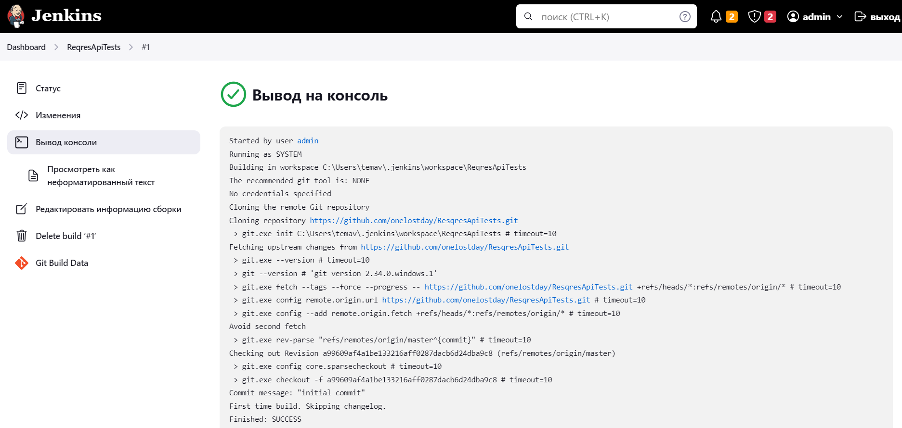

# Проект по API тестированию для <a target="_blank" href="https://reqres.in/">reqres.in</a>

## :pushpin: Содержание:

- [Технологии и инструменты](#rocket-технологии-и-инструменты)
- [Тест кейсы](#scroll-тест-кейсы)
- [Пример запуска из терминала](#computer-пример-запуска-из-терминала)
- [Сборка в Jenkins](#jenkins-job)
- [Allure отчет](#информация-о-тестах-в-allure-report)

## :rocket: Технологии и инструменты

<p align="center">
<a href="https://www.java.com/"></a>
<a href="https://www.jetbrains.com/idea/"></a>
<a href="https://github.com/"></a>
<a href="https://junit.org/junit5/"></a>
<a href="https://gradle.org/"></a>
<a href="https://rest-assured.io/"></a>
<a href="https://github.com/allure-framework/allure2"></a>
<a href="https://www.jenkins.io/"></a>
</p>

## :scroll: Тест кейсы

- ✓ Проверка списка пользователей.
- ✓ Проверка отдельного пользователя.
- ✓ Проверка ответа "Пользователь не найден".
- ✓ Проверка списка ресурсов.
- ✓ Проверка отдельного ресурса.
- ✓ Проверка ответа "Ресурс не найден".
- ✓ Проверка создания нового ресурса.
- ✓ Проверка создания нового пользователя.
- ✓ Проверка обновления данных пользователя PUT запрос.
- ✓ Проверка обновления данных пользователя PATCH запрос.
- ✓ Проверка удаления пользователя.
- ✓ Проверка успешной регистрации пользователя.
- ✓ Проверка ошибки регистрации пользователя.
- ✓ Проверка успешного входа пользователя.
- ✓ Проверка ошибки входа пользователя.

[К содержанию](#pushpin-содержание)

### :computer: Пример запуска из терминала

Запуск из терминала выглядит следующим образом: \
```gradle clean task``` \
```task``` - в данном случае один api_tests

Пример:
```bash
gradle clean test
```

[К содержанию](#pushpin-содержание)

## </a>Jenkins job
#### Сборка в Jenkins

#### Главная страница в Jenkins:

<p align="center">
<a href="https://jenkins.autotests.cloud/job/berezkindv_diploma_rest_api_tests_project/"></a>
</p>

#### Результаты сборки в Jenkins:

<p align="center">
<a href="https://jenkins.autotests.cloud/job/berezkindv_diploma_rest_api_tests_project/"></a>
</p>

[К содержанию](#pushpin-содержание)

## </a>Информация о тестах в Allure report</a>

По завершении сборки можно обратиться к Allure отчету. \
В который входит:
- Протоколирование степов
- Графики прохождения тестов
- Таймлайн
- Различная сортировка тестов по статусу
- И многое другое


#### Основное окно

<p align="center">

</p>

#### Вкладка тесты

<p align="center">

</p>

#### Вкладка графики

<p align="center">

</p>

#### В проекте используется кастомное оформление протоколирования запросов и ответов

<p align="center">

</p>

[К содержанию](#pushpin-содержание)

